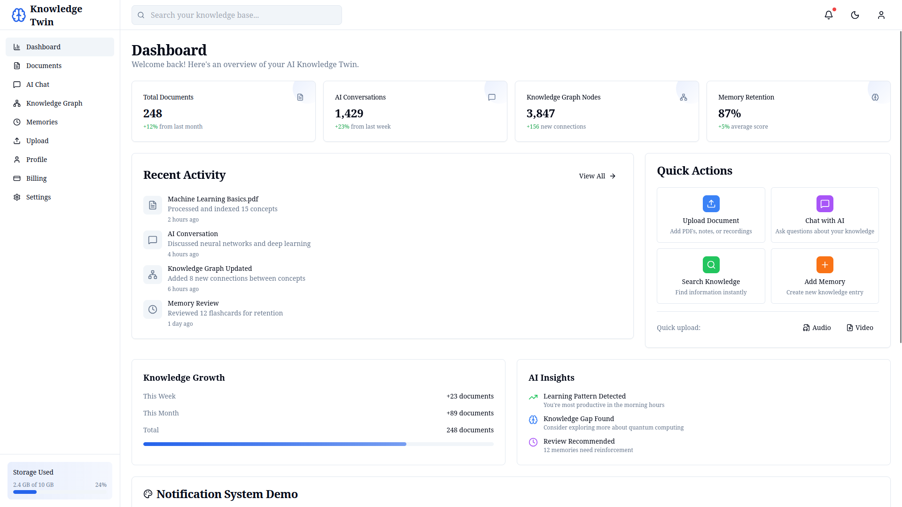

# Congicore - AI Knowledge Twin Platform

A sophisticated AI-powered knowledge management platform that creates a digital twin of your knowledge base. Congicore transforms how you interact with information by combining document management, AI conversations, knowledge graphs, and intelligent memory retention.

## 🚀 Live Demo

Experience the platform at: **[https://congicore.vercel.app/](https://congicore.vercel.app/)**

## 📊 Dashboard Overview



The dashboard provides real-time insights into your knowledge ecosystem with metrics for documents, AI conversations, knowledge graph nodes, and memory retention rates.

## ✨ Key Features

- **📄 Document Management**: Upload, organize, and process multiple document formats
- **🤖 AI Chat Interface**: Natural language conversations with your knowledge base
- **🕸️ Knowledge Graph**: Visual representation of interconnected concepts
- **🧠 Memory System**: Intelligent retention and retrieval of information
- **📈 Analytics Dashboard**: Real-time metrics and insights
- **🔍 Smart Search**: Advanced search across all your knowledge assets

## 🛠️ Technology Stack

### Frontend Framework
 

### UI Components & Styling
  

### Data Visualization
 

### State Management & Data Fetching
 

### Development Tools
  

### File Handling


## 🚀 Getting Started

First, run the development server:

```bash
npm run dev
# or
yarn dev
# or
pnpm dev
# or
bun dev
```

Open [http://localhost:3000](http://localhost:3000) with your browser to see the result.

You can start editing the page by modifying `app/page.tsx`. The page auto-updates as you edit the file.

This project uses [`next/font`](https://nextjs.org/docs/app/building-your-application/optimizing/fonts) to automatically optimize and load [Geist](https://vercel.com/font), a new font family for Vercel.

## 📚 Learn More

To learn more about Next.js, take a look at the following resources:

- [Next.js Documentation](https://nextjs.org/docs) - learn about Next.js features and API.
- [Learn Next.js](https://nextjs.org/learn) - an interactive Next.js tutorial.

You can check out [the Next.js GitHub repository](https://github.com/vercel/next.js) - your feedback and contributions are welcome!

## 🚀 Deploy on Vercel

The easiest way to deploy your Next.js app is to use the [Vercel Platform](https://vercel.com/new?utm_medium=default-template&filter=next.js&utm_source=create-next-app&utm_campaign=create-next-app-readme) from the creators of Next.js.

Check out our [Next.js deployment documentation](https://nextjs.org/docs/app/building-your-application/deploying) for more details.

## 📋 Project Information

- **Project Name**: AI Knowledge Twin
- **Version**: 0.1.0
- **License**: Private
- **Deployment**: Vercel
